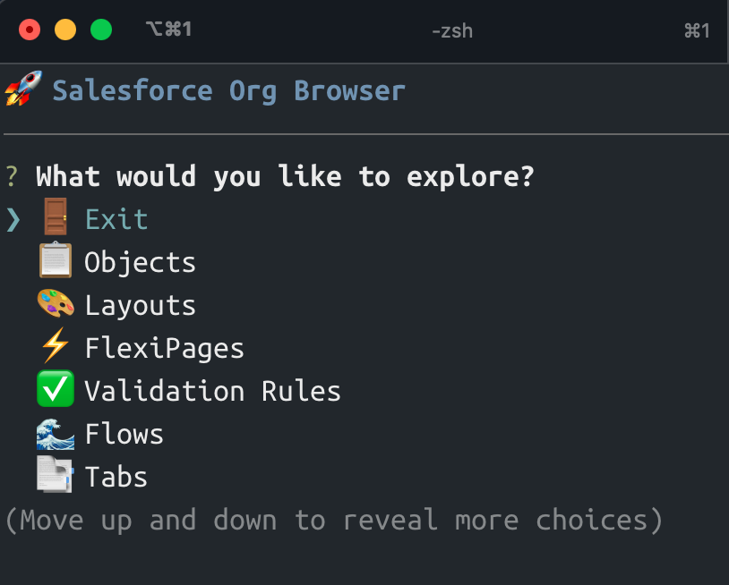

# Salesforce Org Browser

A lightweight Salesforce Org browser for developers switching from VS Code. This tool provides a terminal UI to explore and retrieve Salesforce metadata, with support for all major metadata types.



## Features

- 🔍 **Terminal UI**: Interactive command-line interface for quick exploration
- 📋 **Comprehensive**: Support for all major Salesforce metadata types
- ⚡ **Lightweight**: Fast and dependable performance
- 🔐 **Secure**: Uses standard Salesforce authentication
- 📦 **Export**: Retrieve components for your git workflow
- 🎯 **Simple**: Clean, focused interface without unnecessary complexity

## Quick Start

### Prerequisites

- Node.js 18+ 
- Salesforce org with API access
- Salesforce CLI (sf) installed and configured

### Installation

```bash
# Clone the repository
git clone https://github.com/fad136/salesforce-org-browser.git
cd org-browser

# Install dependencies
npm install
```

### Usage

#### Terminal UI
```bash
# Run the script from any SFDX project root
~/path/to/org-browser/scripts/org-browser tui


```

## Configuration

The tool uses Salesforce CLI authentication. Make sure you have a default org set for your project:

```bash
# Login to your org
sf org login web

# Set as default org for the current project
sf config set target-org your-org-alias
```

## Features in Detail

### Terminal UI
- Interactive tree navigation
- Quick search and filter
- Component preview
- Export to local files
- Clean, intuitive interface

### Supported Metadata Types
- **Objects**: Custom and standard objects
- **Layouts**: Page layouts
- **FlexiPages**: Lightning page layouts and flexipages
- **Validation Rules**: Field and object validation rules
- **Flows**: Flow automation processes
- **Tabs**: Custom tabs and standard tabs
- **Quick Actions**: Quick actions and global actions
- **Permission Sets**: Permission sets and profiles
- **Custom Metadata**: Custom metadata types and records
- **Applications**: Lightning applications
- **Labels**: Custom labels for translations
- **Reports**: Reports and dashboards
- **Report Types**: Report types and templates

## Architecture

The tool is built with a clean, maintainable architecture:

- **Centralized Configuration**: All metadata types defined in one place
- **Dynamic UI Generation**: Menus and options generated from configuration
- **SFDX Integration**: Seamless integration with Salesforce CLI
- **Error Handling**: Robust error handling and user feedback

## Development

```bash
# Start in development mode with auto-reload
npm run dev
```

## License

MIT License - see LICENSE file for details.
